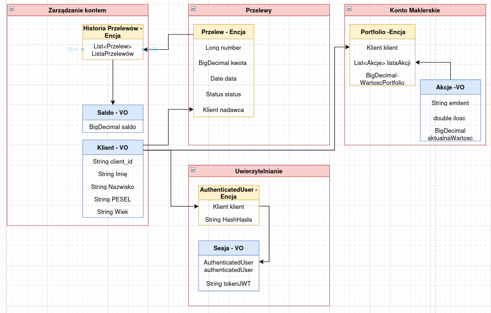

# Opis diagramu

Diagram przedstawia system zaprojektowany zgodnie z zasadami Domain-Driven Design dla aplikacji bankowej. Diagram zawiera cztery Agregaty(Zarządzanie kontem, Przelewy Konto Maklerskie oraz Uwierzytelnianie). Podczas tworzenia schematu zadbałem aby nie używać synonimów np przelewy-tranzakcje, Klient-Użytkownik aby nie zaciemniać obrazu aplikacji. Flow logowania i tworzenia sesji wygląda następująco:

1. Logowanie i uwierzytelnienie

- Podczas logowania weryfikowane są dane użytkownika
- Jeśli dane są poprawne, tworzony jest obiekt encji `AuthenticatedUser`, który zawiera:
  - Informacje o kliencie (z obiektu wartości `Klient`).
  - Hash hasła (`HashHasła`), który jest przechowywany tylko tak długo, jak to konieczne do utworzenia sesji.

2. Tworzenie sesji

- Na podstawie encji `AuthenticatedUser` tworzony jest obiekt wartości `Sesja`. Zawiera on:
  - Informacje o uwierzytelnionym użytkowniku (`AuthenticatedUser`).
  - Token JWT (`tokenJWT`), który zapewnia bezpieczne uwierzytelnienie podczas trwania sesji

3. Zabezpieczenia

- Hash hasła (`HashHasła`) nie jest przechowywany długoterminowo
- Sesje oparte na JWT są bezstanowe i rotowane w ustalonych interwałąch.

